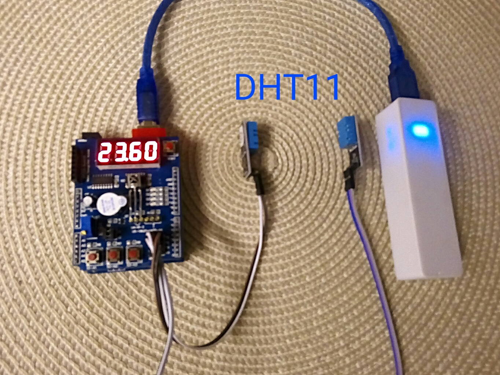

# Arduino Temperature Data Logger for Multi function shield

* Arduino Uno R3
* Multi function shield
* 2x DHT11 Temperature Sensor
* Power Bank

This low cost data logger using a Multi-Function Shield to display the temperature of two DHT11 sensors, switch firmware mode at startup by push button and store messures at built-in EEPROM.
 

## Data Logger (default mode)

At default mode the temperature of the two DHT11 sensors written to persistance EEPROM every tree minutes. You can log the temperature for 24 hours with 8-bit resolution (0.25'C).

## Clear logged data (middle button)

Hold down the middle button (A2) and press the reset button. After boot message the display show "clEr". Wait a moment and the display show " End" until the EEPROM is formated.

## Read logged data (left button)

Start the Arduino IDE software and connect the usb cabble to the usb port at your computer. Hold down the left button (A1) and open the serial communication or serial plotter at the Arduino IDE. The Arduino should restart and send the stored data to your computer.

## Display logged data (right button)

Hold down the right button (A3) and press the reset button. After boot message the display show "dAtA" and the stored data for the first messures. Now you can navigate by pushing the left/right button.

## Use case

I need this gadget to check the functionality of my camping refrigerator. It messured the temperature inside and outside of the refrigerator or at refrigerator and ice box.

Most power banks will turn off after 10-15 seconds. That's the reason I display the values every 8 seconds to keep-alive the power bank (the display draw 100-200 mA of current). You can run the data logger for 2-3 days by power bank.
