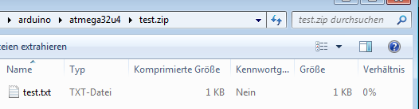
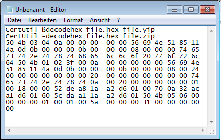

# Payload ZIP-File

## create c code for payload

* test.txt - uncompress file(s)
* test.zip - compressed file
* test2hex.cmd - convert binary to hex
* test.hex - hex file
* test.c - manually converted c code

## decode payload to zip file

* file.hex - playload
* file2hex.cmd - convert hex to binary
* file.zip - compressed file
